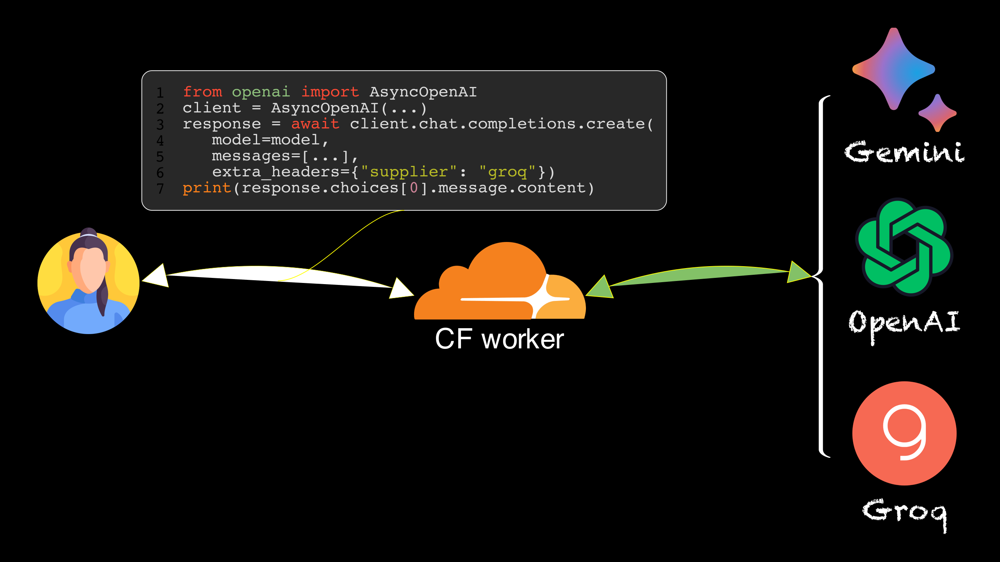

一个基于 [cloudflare worker](https://workers.cloudflare.com/) 的 LLM API 反向代理，支持 OpenAI, Gemini, Groq 等平台 API，接口兼容 OpenAI API 规范，可以直接使用 OpenAI SDK 调用。



# Quick start
Demo API: `https://llmapi.ultrasev.com`

[Groq API](https://console.groq.com/docs/quickstart) 使用示例：
```python
from openai import OpenAI

api_key = "YOUR_GROQ_API_KEY"
model = "llama3-8b-8192"
supplier = "groq"

BASE_URL = "https://llmapi.ultrasev.com"

client = OpenAI(base_url=BASE_URL, api_key=api_key)
response = client.chat.completions.create(
    model=model,
    messages=[
        {"role": "system", "content": "You are a helpful assistant。"},
        {"role": "user", "content": "what is the result of 2 * 21?"}
    ],
    extra_headers={"supplier": supplier},
)
print(response.choices[0].message.content)
```

OpenAI, Gemini 等平台的使用方法与 Groq 类似，只需要修改平台 `supplier` 即可。
```python
supplier_list = ["openai", "gemini", "groq"]
```


# 部署自己的 Worker
创建一个新的 Worker，然后把[xxxxx](???)中的代码粘贴进去，然后部署就可以了。

## Note
- 代码中 Groq 代理又通过 vercel.com + FastAPI 套了一层，仅做请求中转，不会保存任何数据。介意的话可以自己部署。
